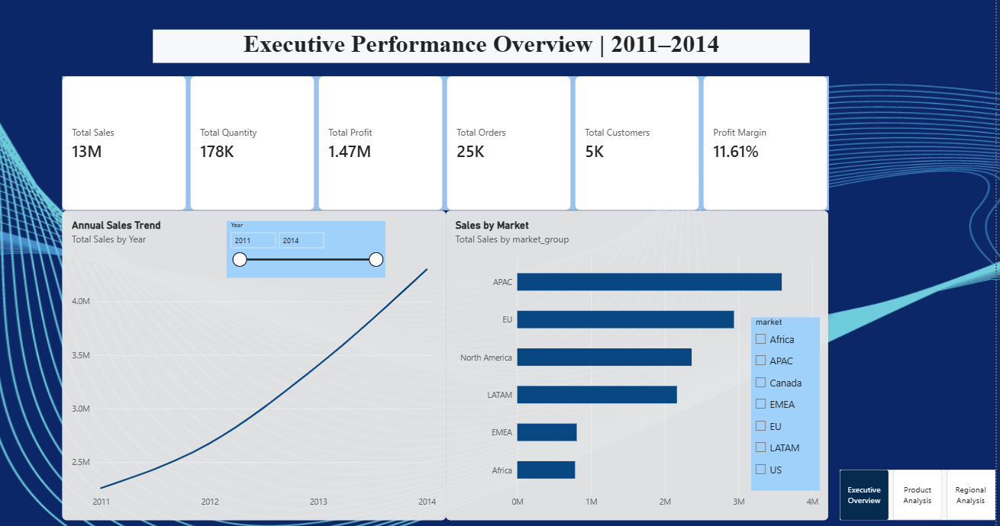
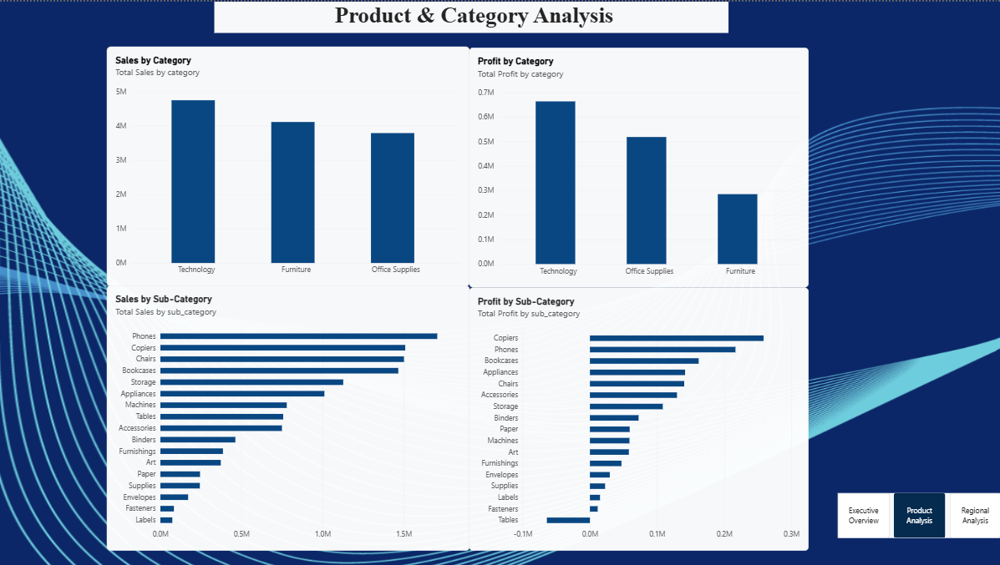
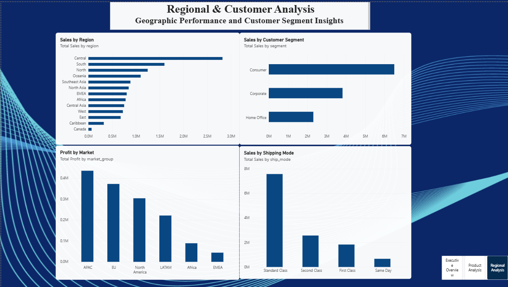

# 🌍 Global Retail Sales Analysis

## 📌 Project Overview

This project presents an end-to-end data analytics analysis of a global retail dataset. The objective is to transform raw transactional data into meaningful business insights using **Python, SQL, PostgreSQL, and Power BI**.

The project analyzes global retail performance across multiple dimensions, including:

- Sales performance
- Profitability
- Discount impact
- Product categories
- Sub-categories
- Markets and regions
- Customer segments
- Shipping modes
- Yearly and monthly trends

The final output is an interactive **three-page Power BI dashboard** designed to support business decision-making.

---

# 🎯 Business Objectives

The main objectives of this project were to answer the following business questions:

1. How are sales and profits performing over time?
2. Which markets generate the highest sales and profits?
3. Which product categories and sub-categories perform best?
4. How does discounting impact profitability?
5. Which regions and customer segments contribute the most to sales?
6. What are the monthly and quarterly sales trends?
7. Which shipping modes generate the highest sales?
8. Which areas of the business require attention due to low or negative profitability?

---

# 🛠️ Technologies Used

| Technology | Purpose |
|---|---|
| Python | Data cleaning and exploratory data analysis |
| Pandas | Data manipulation and transformation |
| Matplotlib | Data visualization |
| PostgreSQL | Database storage and SQL analysis |
| pgAdmin 4 | PostgreSQL database management |
| SQL | Business analysis queries |
| Power BI | Interactive dashboard development |
| GitHub | Project documentation and portfolio hosting |

---

# 📂 Project Structure

```text
global-retail-sales-analysis/
│
├── data/
│   ├── raw/
│   │   └── global_superstore.csv
│   │
│   └── processed/
│       └── cleaned_superstore.csv
│
├── notebooks/
│   ├── 01_data_cleaning.ipynb
│   └── 02_exploratory_analysis.ipynb
│
├── sql/
│   ├── 01_database_schema.sql
│   ├── 02_data_cleaning.sql
│   └── 03_business_analysis.sql
│
├── dashboard/
│   └── Global_Retail_Dashboard.pbix
│
├── images/
│   ├── dashboard_overview.png
│   ├── product_analysis.png
│   └── regional_analysis.png
│
└── README.md
```

---

# 📊 Dataset

The dataset contains global retail transaction records across different countries, markets, product categories, customers, and shipping methods.

### Key Features

- Category
- Sub-Category
- Product Name
- Customer ID
- Customer Name
- Segment
- Country
- City
- State
- Region
- Market
- Order Date
- Ship Date
- Order Priority
- Ship Mode
- Sales
- Profit
- Quantity
- Discount
- Shipping Cost

Additional features were created during data analysis and feature engineering, including:

- Year
- Month
- Month Name
- Quarter
- Week Number
- Shipping Days
- Market Group
- Profit Margin
- Discount Percentage

---

# 🧹 Data Cleaning & Preparation

Data cleaning was performed using Python and Pandas.

The following steps were completed:

- Checked dataset dimensions and column names
- Inspected data types
- Identified missing values
- Checked duplicate records
- Converted date columns to datetime format
- Standardized column names
- Created additional analytical features
- Calculated shipping duration
- Prepared a cleaned dataset for SQL and Power BI analysis

## Feature Engineering

Several new analytical variables were created:

- Year
- Month
- Month Name
- Quarter
- Week Number
- Shipping Days
- Market Group
- Profit Margin
- Discount Percentage

The cleaned dataset was exported and used for further SQL analysis and Power BI dashboard development.

---

# 🐍 Python Exploratory Data Analysis

Exploratory Data Analysis (EDA) was conducted to understand business performance and identify patterns in sales and profitability.

Key areas analyzed:

- Overall sales and profit
- Sales trends
- Profit trends
- Category performance
- Sub-category performance
- Market performance
- Regional performance
- Discount impact
- Shipping analysis

---

# 💰 Discount & Profitability Analysis

One of the major analyses in this project focused on understanding the relationship between discount levels and profitability.

The analysis revealed a clear relationship between higher discounts and declining profit margins.

### Key Observations

- Low or zero discounts generally maintained strong profitability.
- Moderate discounts showed declining margins.
- Higher discount levels resulted in significant profit reduction.
- Several high-discount transactions generated negative profits.

This analysis demonstrates the importance of developing a controlled discount strategy rather than applying aggressive discounts without considering profitability.

---

# 🗄️ SQL Analysis

The cleaned dataset was imported into PostgreSQL for structured business analysis.

SQL was used to answer important business questions related to:

- Yearly sales growth
- Yearly profit growth
- Monthly sales performance
- Monthly profitability
- Sales ranking
- Quarterly performance
- Market performance
- Category performance
- Product performance
- Customer analysis

---

## 📈 Yearly Performance

The business showed consistent growth between 2011 and 2014.

| Year | Total Sales | Total Profit |
|---|---:|---:|
| 2011 | 2.26M | 248.94K |
| 2012 | 2.68M | 307.42K |
| 2013 | 3.41M | 406.94K |
| 2014 | 4.30M | 504.17K |

Sales increased consistently year over year, demonstrating strong business growth.

---

## 📅 Monthly Performance

Monthly analysis showed that sales performance varied significantly throughout the year.

The strongest sales months included:

- December
- November
- September
- August
- June

These insights can support:

- Seasonal inventory planning
- Marketing campaigns
- Promotional strategies
- Resource allocation

---

## 📊 Quarterly Performance

Quarterly analysis showed increasing sales throughout the year.

| Quarter | Total Sales | Total Profit |
|---|---:|---:|
| Q1 | 1.99M | 238.56K |
| Q2 | 2.87M | 325.10K |
| Q3 | 3.48M | 400.36K |
| Q4 | 4.30M | 503.44K |

Q4 generated the highest sales and profit, indicating strong end-of-year business performance.

---

## 🌍 Market Performance

The analysis compared sales and profitability across global markets.

Key markets included:

- APAC
- EU
- North America
- LATAM
- EMEA
- Africa

APAC generated the highest sales volume, while profitability varied across markets.

This highlights the importance of analyzing both **revenue and profit**, rather than focusing only on sales.

---

# 📊 Power BI Dashboard

An interactive Power BI dashboard was developed to visualize the key insights from the analysis.

The dashboard consists of three pages.

---

## 🏠 Page 1 — Executive Overview

The Executive Overview provides a high-level summary of overall business performance.

### Key KPIs

- Total Sales
- Total Profit
- Profit Margin
- Total Orders
- Total Customers
- Total Quantity

### Visualizations

- Annual Sales Trend
- Sales by Market

---

## 📦 Page 2 — Product Analysis

This page focuses on product and category performance.

### Visualizations

- Sales by Category
- Profit by Category
- Sales by Sub-Category
- Profit by Sub-Category

This analysis helps identify high-performing and underperforming product groups.

---

## 🌎 Page 3 — Regional Analysis

This page analyzes geographical and customer-related performance.

### Visualizations

- Sales by Region
- Sales by Customer Segment
- Profit by Market
- Sales by Shipping Mode

---

# 📷 Dashboard Preview

## Executive Overview



---

## Product Analysis



---

## Regional Analysis



---

# 📌 Key Business Insights

Based on the analysis, several important insights were identified.

## 📈 1. Strong Year-over-Year Growth

Sales increased consistently from 2011 to 2014, with 2014 generating the highest sales and profit.

---

## 🗓️ 2. Strong Q4 Performance

The fourth quarter generated the highest sales and profit, suggesting strong seasonal demand toward the end of the year.

---

## 🌏 3. APAC is the Largest Sales Market

APAC generated the highest sales among the analyzed market groups.

However, high sales volume should always be evaluated alongside profitability.

---

## 💸 4. High Discounts Reduce Profitability

The discount analysis revealed that increasing discount percentages significantly reduced profit margins.

At high discount levels, several transactions became unprofitable.

This suggests the business should implement a more controlled and data-driven discount strategy.

---

## 📦 5. Product Performance Varies Across Categories

Different product categories and sub-categories demonstrated significant differences in sales and profitability.

Sales performance alone does not always indicate profitability, making profit analysis essential for business decision-making.

---

## 📊 6. Seasonal Trends Can Support Business Planning

Higher sales during specific months and quarters indicate opportunities for:

- Inventory optimization
- Seasonal promotions
- Workforce planning
- Marketing campaigns

---

# 💡 Business Recommendations

Based on the analysis, the following recommendations can be considered:

## 1. Optimize Discount Strategy

Review high-discount transactions and introduce discount thresholds to reduce loss-making sales.

## 2. Focus on High-Profit Products

Prioritize high-performing categories and sub-categories when planning inventory and marketing campaigns.

## 3. Prepare for Q4 Demand

Increase inventory and operational capacity ahead of the strong Q4 sales period.

## 4. Investigate Low-Profit Markets

Markets with lower profit margins should be investigated to understand whether operational costs, discounting, or product mix are affecting profitability.

## 5. Monitor Loss-Making Products

Regularly monitor products and sub-categories generating negative profits.

## 6. Use Seasonal Insights

Use monthly and quarterly trends to improve demand forecasting and business planning.

---

# 📚 Skills Demonstrated

This project demonstrates practical skills in:

- Data Cleaning
- Data Transformation
- Exploratory Data Analysis
- Feature Engineering
- SQL
- PostgreSQL
- Business Analysis
- Data Visualization
- Power BI
- DAX
- Data Modeling
- KPI Development
- Time Intelligence
- Dashboard Design
- Business Insight Generation

---

# 🔄 Data Analytics Workflow

```text
Raw Data
   ↓
Python Data Cleaning
   ↓
Feature Engineering
   ↓
Exploratory Data Analysis
   ↓
Cleaned Dataset
   ↓
PostgreSQL Database
   ↓
SQL Business Analysis
   ↓
Power BI Data Model
   ↓
DAX Measures
   ↓
Interactive Dashboard
   ↓
Business Insights & Recommendations
```

---

# 🚀 Future Improvements

Potential future enhancements for this project include:

- Customer Lifetime Value analysis
- Customer segmentation using RFM analysis
- Sales forecasting
- Demand prediction
- Product recommendation analysis
- Automated data pipelines
- Power BI Service deployment
- Real-time dashboard integration

---

# 👤 Author

**Mohammad Sinan**

Aspiring Data Analyst | Business Intelligence | SQL | Python | Power BI

### Skills

- Python
- SQL
- PostgreSQL
- Power BI
- Pandas
- Data Visualization
- Business Analytics

---

## ⭐ If You Found This Project Useful

Feel free to explore the notebooks, SQL queries, and Power BI dashboard included in this repository.
